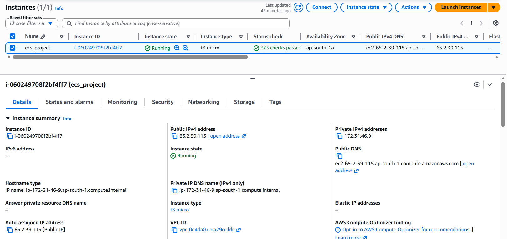

# 🚀 AWS ECS CI/CD Pipeline using Docker, Amazon ECS Fargate & AWS DevOps


## 📌 Project Overview
This project demonstrates an end-to-end production-style deployment of a containerized web application on AWS.
The application is first deployed manually using Docker, Amazon ECR and Amazon ECS Fargate to understand the complete deployment workflow.
The deployment process is then fully automated using AWS CodePipeline and AWS CodeBuild, enabling Continuous Integration and Continuous Deployment (CI/CD).
The infrastructure is secured using AWS WAF, HTTPS with AWS Certificate Manager, custom domain routing using Amazon Route 53, monitored using Amazon CloudWatch, configured with Amazon SNS notifications, and automatically scales using ECS Service Auto Scaling.

---

# 🏗 Architecture

## Complete Solution Architecture

> *(Insert your final architecture diagram here)*

```text
architecture/complete-architecture.png
```

## CI/CD Pipeline Architecture

> *(Insert CI/CD architecture here)*

```text
architecture/cicd-architecture.png
```
---

## ✨ Features
- Docker Containerization
- Amazon ECS Fargate Deployment
- Amazon Elastic Container Registry (ECR)
- AWS CodeBuild
- AWS CodePipeline
- Application Load Balancer
- Route 53 Custom Domain
- HTTPS using AWS Certificate Manager
- AWS WAF Protection
- CloudWatch Dashboard
- CloudWatch Logs
- CloudWatch Alarms
- Amazon SNS Email Notifications
- ECS Service Auto Scaling
- High Availability across Multiple Availability Zones

---

# 🛠 Tech Stack
| Category | Technologies |
|-----------|--------------|
| Cloud | AWS |
| Compute | Amazon ECS Fargate, Amazon EC2 |
| Containerization | Docker |
| Registry | Amazon ECR |
| CI/CD | AWS CodePipeline, AWS CodeBuild |
| Networking | VPC, ALB, Route53, NAT Gateway |
| Security | IAM, ACM, WAF, Security Groups |
| Monitoring | CloudWatch, SNS |
| Languages | HTML, CSS, JavaScript |
| Operating System | Amazon Linux 2023 |

# ☁️ AWS Services Used

| AWS Service | Purpose |
|--------------|---------|
| Amazon EC2 | Manual Docker build server |
| Amazon ECS | Container orchestration service |
| AWS Fargate | Serverless compute engine for containers |
| Amazon ECR | Private Docker image registry |
| AWS CodeBuild | Builds Docker images automatically |
| AWS CodePipeline | Automates CI/CD deployments |
| Application Load Balancer | Distributes incoming traffic across ECS tasks |
| Amazon Route 53 | Custom domain name routing |
| AWS Certificate Manager (ACM) | SSL/TLS certificate for HTTPS |
| AWS WAF | Protects the application from common web attacks |
| Amazon CloudWatch | Monitoring, dashboards, logs, and alarms |
| Amazon SNS | Email notifications from CloudWatch alarms |
| IAM | Access management and service permissions |
| Amazon VPC | Network isolation |
| NAT Gateway | Internet access for private subnets |
| Internet Gateway | Public internet connectivity |
| Security Groups | Firewall rules for AWS resources |

---

# 📂 Repository Structure

```text
aws-ecs-cicd-pipeline/
│
├── architecture/
│   ├── complete-architecture.png
│   ├── deployment-architecture.png
│   └── cicd-architecture.png
│
├── screenshots/
│   ├── manual-deployment/
│   ├── cicd/
│   ├── monitoring/
│   └── security/
│
├── css/
├── js/
├── images/
├── fonts/
│
├── Dockerfile
├── buildspec.yml
├── README.md
│
├── index.html
├── about.html
├── contact.html
├── service.html
└── guard.html
```

---

# 🌐 Infrastructure Overview
The infrastructure is deployed inside a custom Amazon VPC across two Availability Zones for high availability.

### Public Subnets
- Application Load Balancer
- NAT Gateway
- EC2 Build Server (Manual Deployment)

### Private Subnets
- Amazon ECS Fargate Tasks

### Networking Components
- Internet Gateway
- Route Tables
- Elastic IPs
- Security Groups

---

# 🔄 Deployment Workflow
## Manual Deployment
```text
GitHub Repository
        │
        ▼
EC2 Build Server
        │
Docker Build
        │
        ▼
Amazon ECR
        │
        ▼
Amazon ECS Task Definition
        │
        ▼
Amazon ECS Service
        │
        ▼
Application Load Balancer
        │
        ▼
Users
```

---

## Automated CI/CD Workflow
```text
Developer
    │
Git Push
    │
    ▼
GitHub Repository
    │
    ▼
AWS CodePipeline
    │
    ▼
AWS CodeBuild
    │
Docker Build
    │
Push Image
    ▼
Amazon ECR
    │
    ▼
Amazon ECS Service
    │
Rolling Deployment
    ▼
Application Load Balancer
    │
HTTPS
    ▼
Users
```

# 🚀 Phase 1 – Manual Deployment
The application was manually deployed to Amazon ECS Fargate to understand the complete deployment workflow before implementing CI/CD automation.

---

## Step 1 – Launch Amazon EC2 Build Server
- Launched an Amazon Linux 2023 EC2 instance.
- Configured an IAM Role with Amazon ECR permissions.
- Installed Docker, Git, and AWS CLI.

### Screenshot


---

## Step 2 – Clone Application Source Code
The application source code was cloned from the GitHub repository to the EC2 build server.
```bash
git clone https://github.com/<your-username>/aws-ecs-cicd-pipeline.git
```

---

## Step 3 – Build Docker Image
The application was containerized using Docker.
```bash
docker build -t web-ecs-app .
```
### Screenshot


---

## Step 4 – Create Amazon ECR Repository
A private Amazon Elastic Container Registry (ECR) repository was created to store Docker images.
### Screenshot


---

## Step 5 – Push Docker Image to Amazon ECR
The Docker image was tagged and pushed to Amazon ECR.
```bash
docker tag web-ecs-app:latest <ACCOUNT_ID>.dkr.ecr.ap-south-1.amazonaws.com/web-ecs-repository:latest
docker push <ACCOUNT_ID>.dkr.ecr.ap-south-1.amazonaws.com/web-ecs-repository:latest
```
### Screenshot


---

## Step 6 – Create Amazon ECS Cluster
An Amazon ECS Cluster using the AWS Fargate launch type was created.
### Screenshot


---

## Step 7 – Create Task Definition
Configured an ECS Task Definition using:
- AWS Fargate
- Amazon ECR Image
- CloudWatch Logs
- 0.25 vCPU
- 0.5 GB Memory
### Screenshot


---

## Step 8 – Configure Application Load Balancer
Created:
- Target Group
- Internet-facing Application Load Balancer
- Listener
- Health Checks
### Screenshot


---

## Step 9 – Deploy ECS Service
Created the ECS Service using:
- ECS Cluster
- Task Definition
- Application Load Balancer
- Target Group
Configured Service Auto Scaling for automatic scaling based on application traffic.
### Screenshot


---

## Step 10 – Configure Route 53 & HTTPS
Configured:
- Route 53 Hosted Zone
- Custom Domain
- AWS Certificate Manager
- HTTPS Listener
### Screenshots


---

## Step 11 – Protect Application using AWS WAF
Attached an AWS WAF Web ACL to the Application Load Balancer to protect the application against common web exploits.
### Screenshot


---

## Step 12 – Verify Application
The application was successfully deployed and accessed through the Application Load Balancer using HTTPS.
### Screenshot

