# 🚀 End-to-End AWS ECS Fargate CI/CD Pipeline using Docker, CodePipeline & CodeBuild


## 📌 Project Overview

This project demonstrates an end-to-end production-style deployment of a containerized web application on AWS. \
The application is first deployed manually using Docker, Amazon ECR and Amazon ECS Fargate to understand the complete deployment workflow. \
The deployment process is then fully automated using AWS CodePipeline and AWS CodeBuild, enabling Continuous Integration and Continuous Deployment (CI/CD). \
The infrastructure is secured using AWS WAF, HTTPS with AWS Certificate Manager, custom domain routing using Amazon Route 53, monitored using Amazon CloudWatch, configured with Amazon SNS notifications, and automatically scales using ECS Service Auto Scaling.

## 🏗 Architecture

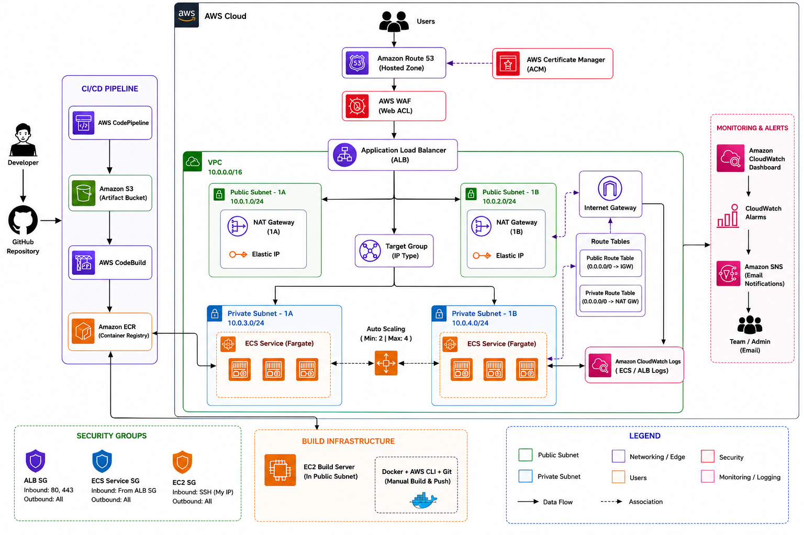

## ✨ Features

- Containerized web application using Docker
- Amazon ECS Fargate deployment
- Automated CI/CD using CodePipeline & CodeBuild
- Private Docker image registry with Amazon ECR
- HTTPS using ACM & Route 53
- AWS WAF web protection
- ECS Service Auto Scaling
- CloudWatch dashboards, logs, alarms and monitoring
- SNS email notifications
- Highly available architecture across two Availability Zones

## 🛠 Tech Stack

| Category | Technologies |
|-----------|--------------|
| Cloud | AWS |
| Compute | Amazon ECS Fargate, Amazon EC2 |
| Containerization | Docker |
| Registry | Amazon ECR |
| CI/CD | AWS CodePipeline, AWS CodeBuild |
| Networking | VPC, ALB, Route53, NAT Gateway |
| Security | IAM, ACM, WAF, Security Groups |
| Monitoring | CloudWatch, SNS |
| Languages | HTML, CSS, JavaScript |
| Operating System | Amazon Linux 2023 |

## 📂 Repository Structure

```text
aws-ecs-cicd-pipeline/
│
├── architecture/
│   └── complete-architecture.png
│
├── screenshots/
│   ├── 01-networking/
│   ├── 02-manual-deployment/
│   ├── 03-security/
│   ├── 04-monitoring/
│   └── 05-cicd/
│
├── css/
├── js/
├── images/
├── fonts/
│
├── Dockerfile
├── buildspec.yml
├── README.md
├── index.html
├── about.html
├── service.html
├── contact.html
└── guard.html
```

---

## 🚀 Deployment

### Phase 1 – Manual Deployment

- Launched Amazon Linux 2023 EC2 Build Server
- Installed Docker, Git and AWS CLI
- Cloned the application from GitHub
- Built the Docker image
- Created Amazon ECR repository
- Pushed Docker image to Amazon ECR
- Created Amazon ECS Cluster (Fargate)
- Created Task Definition
- Configured Application Load Balancer
- Created ECS Service
- Configured ECS Auto Scaling
- Configured Route53 custom domain
- Enabled HTTPS using AWS Certificate Manager
- Protected the application using AWS WAF
- Verified successful deployment through the Application Load Balancer using HTTPS.

### Screenshots

| EC2 | ECR |
|------|-----|
| 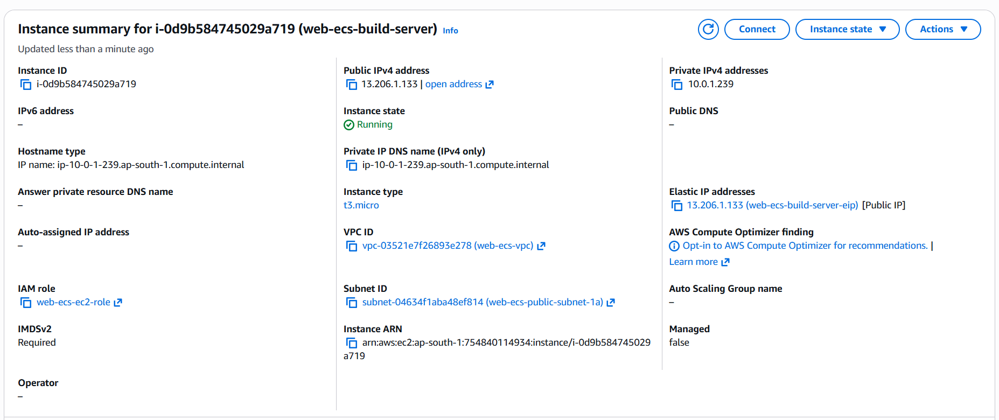 | 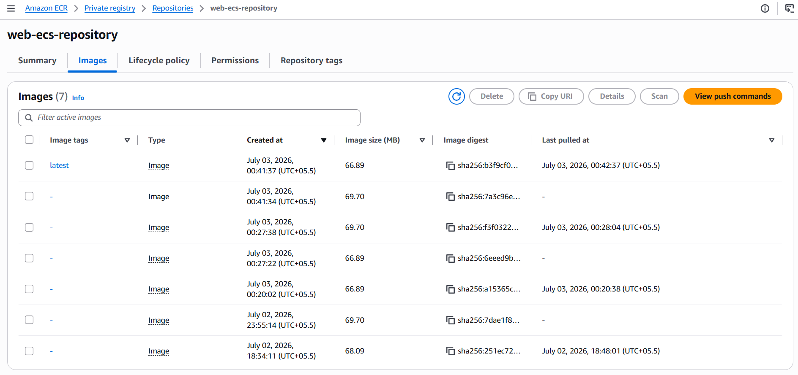 |

| ECS Cluster | ECS Service |
|-------------|-------------|
| 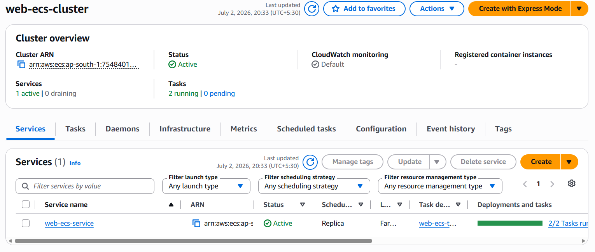 | 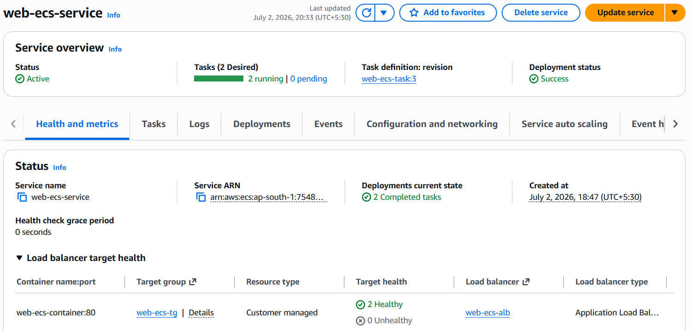 |

| ALB | Website |
|-----|---------|
| 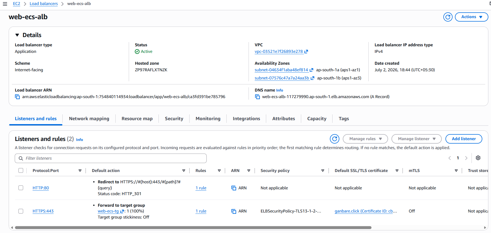 | 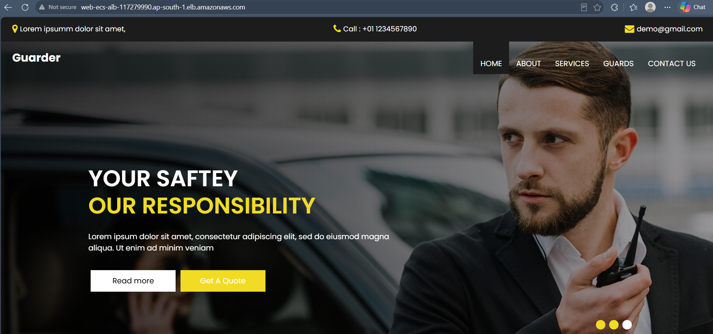 |

---

### ⚙️ Phase 2 – CI/CD Automation

The manual deployment process was automated using AWS CodePipeline and AWS CodeBuild, enabling continuous delivery from GitHub to Amazon ECS.
Workflow: GitHub → CodePipeline → CodeBuild → Amazon ECR → Amazon ECS

### Pipeline Process
- Source code pushed to GitHub
- CodePipeline automatically triggered
- CodeBuild built the Docker image
- Docker image pushed to Amazon ECR
- ECS Service automatically updated
- Rolling deployment completed successfully

### Screenshots

| CodeBuild | CodePipeline |
|-----------|--------------|
| 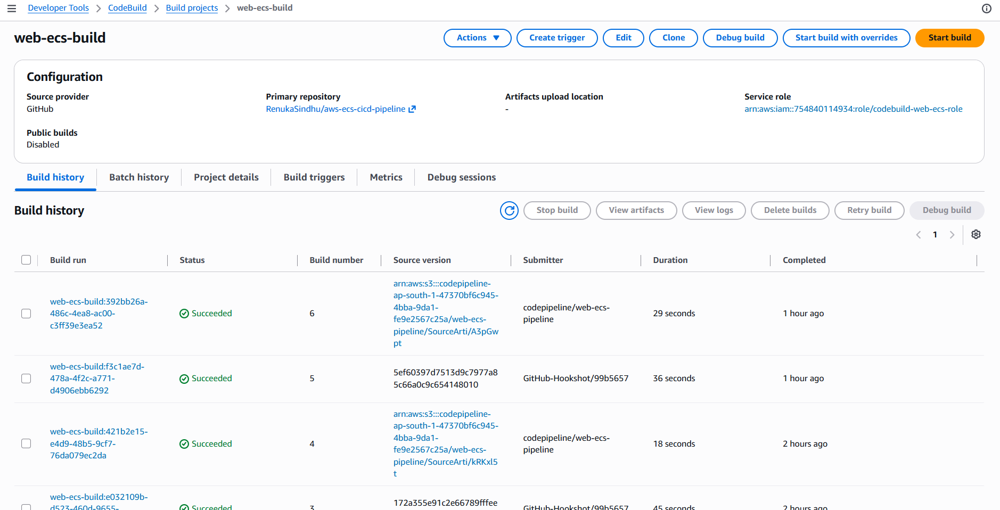 | 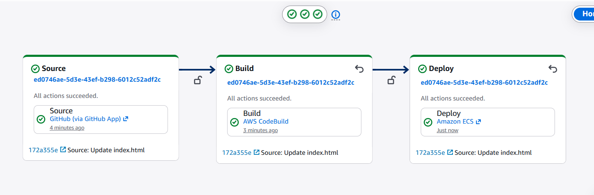 |

| Updated ECS Task Definition | Https + Updated Website |
|----------------------------|-----------------|
| 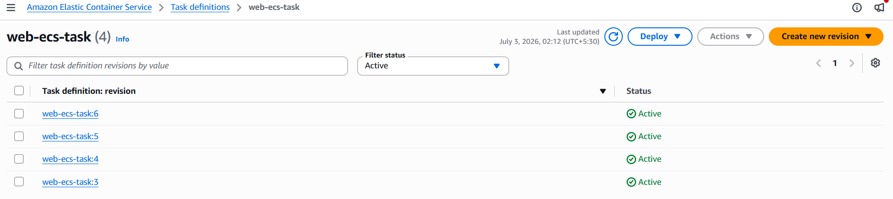 | 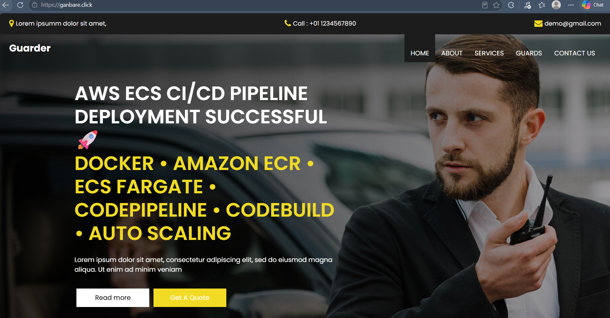 |

---

## 📊 Monitoring & Scaling

Monitoring and scaling components:
- CloudWatch Dashboard
- CloudWatch Logs
- CloudWatch Alarms
- Amazon SNS Notifications
- ECS Service Auto Scaling

### Auto Scaling Test
Apache Benchmark (ab) was used to generate traffic.
Observed behavior:
- ECS Service scaled out from **2** tasks to **4** tasks under heavy load.
- After traffic subsided, the service automatically scaled back to **2** tasks.

### Screenshots

| CloudWatch Dashboard | ECS Auto Scaling |
|----------------------|------------------|
| 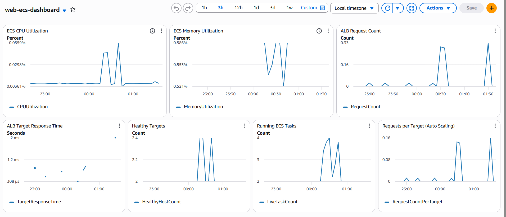 | 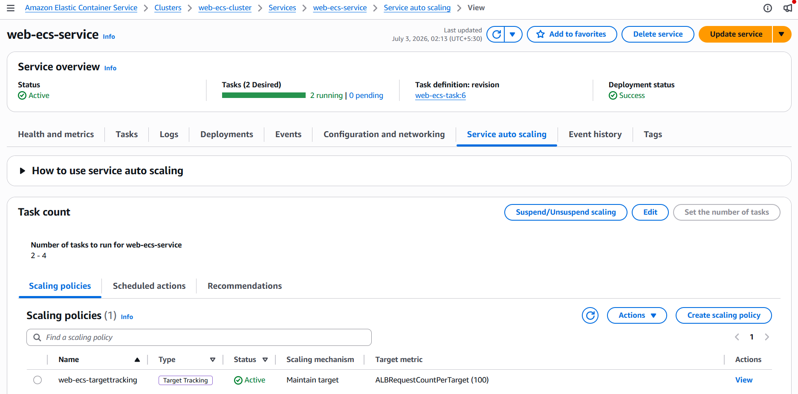 |

| Scaling Activities | Max Scaled-Out Tasks |
|--------------------|----------------------|
| 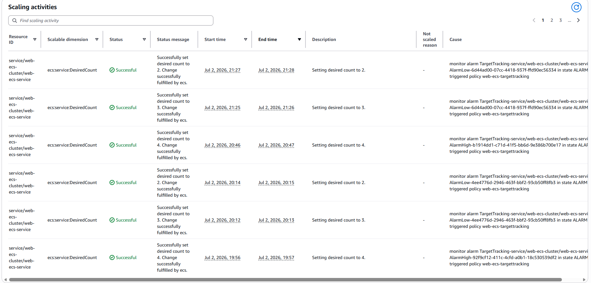 | 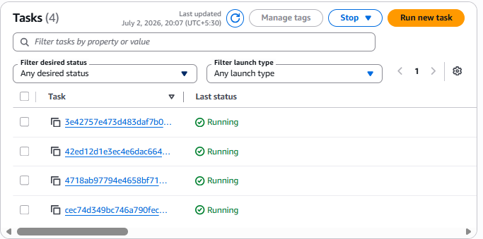 |

## 🔒 Security
The application is secured using multiple AWS security services, encrypted HTTPS communication, and network isolation best practices.

### Security Implementations

- IAM Roles with least-privilege permissions
- Security Groups for EC2, ALB, and ECS tasks
- AWS Certificate Manager (ACM) for HTTPS
- Amazon Route 53 for custom domain routing
- AWS WAF Web ACL attached to the Application Load Balancer
- Private subnets for ECS Fargate tasks
- NAT Gateway for outbound internet access from private subnets

### Screenshots

| AWS WAF | HTTPS (ACM + Route 53) |
|----------|------------------------|
| 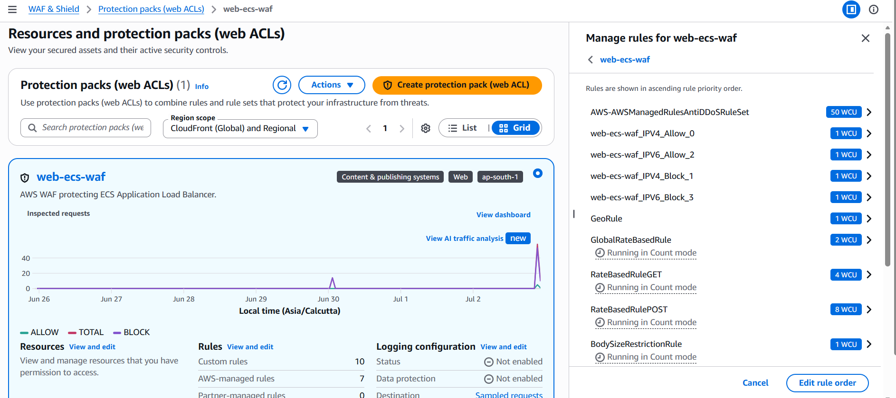 |  |

| AWS Certificate Manager | Route 53 DNS Records |
|--------------------------|----------------------|
| 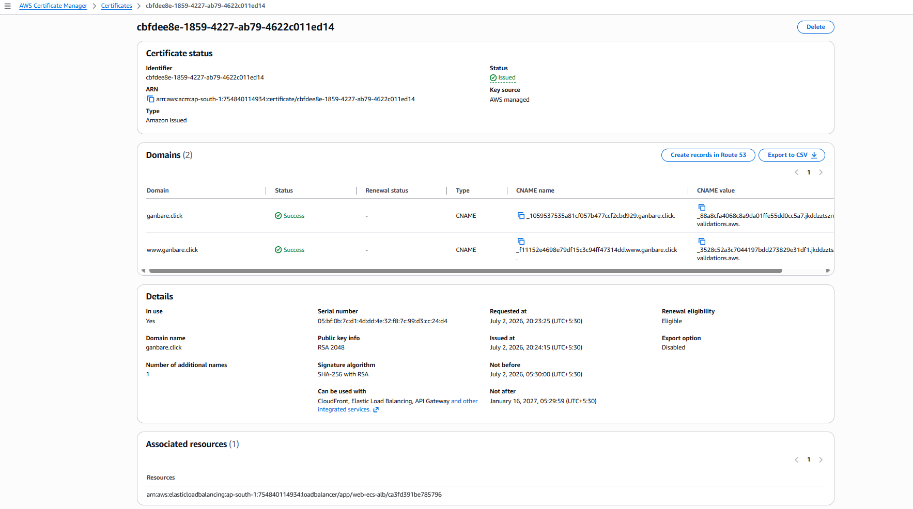 | 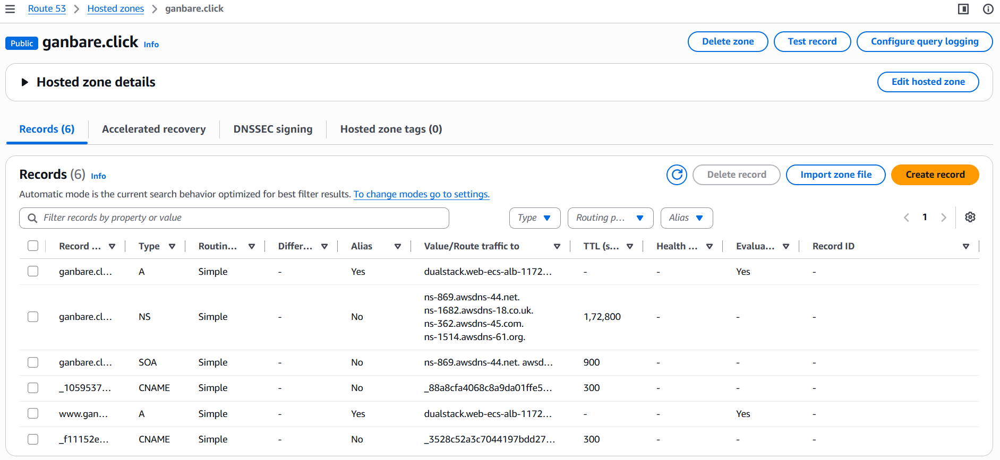 |

## 🎯 Key Learnings
Throughout this project, I gained hands-on experience with:
- Docker containerization
- Amazon ECR image management
- Amazon ECS Fargate deployments
- Application Load Balancer configuration
- ECS Service Auto Scaling
- CI/CD automation using AWS CodeBuild and CodePipeline
- CloudWatch dashboards, logs, and alarms
- Amazon SNS notifications
- Route 53 DNS management
- HTTPS configuration using AWS Certificate Manager
- AWS WAF for web application protection
- Designing a highly available architecture across multiple Availability Zones

## 🚀 Future Enhancements
- Move the EC2 Build Server to a private subnet and manage it securely using AWS Systems Manager (SSM).
- Replace NAT Gateway internet access with VPC Endpoints to improve security and reduce infrastructure costs.
- Provision the complete infrastructure using Terraform (Infrastructure as Code).
- Implement Blue/Green deployments for zero-downtime releases.
- Store sensitive configuration and secrets using AWS Secrets Manager.
- Integrate GitHub Actions as an alternative CI/CD pipeline.
- Configure centralized log analysis and advanced monitoring using Prometheus and Grafana.
