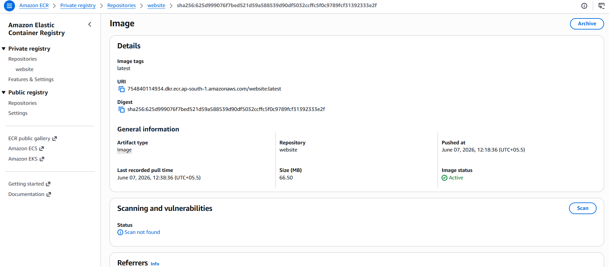
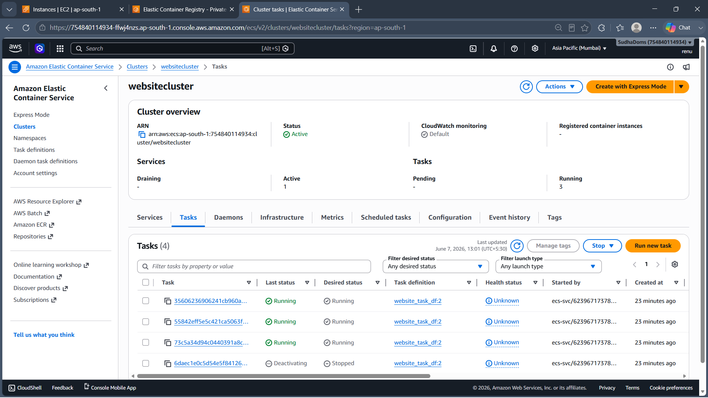
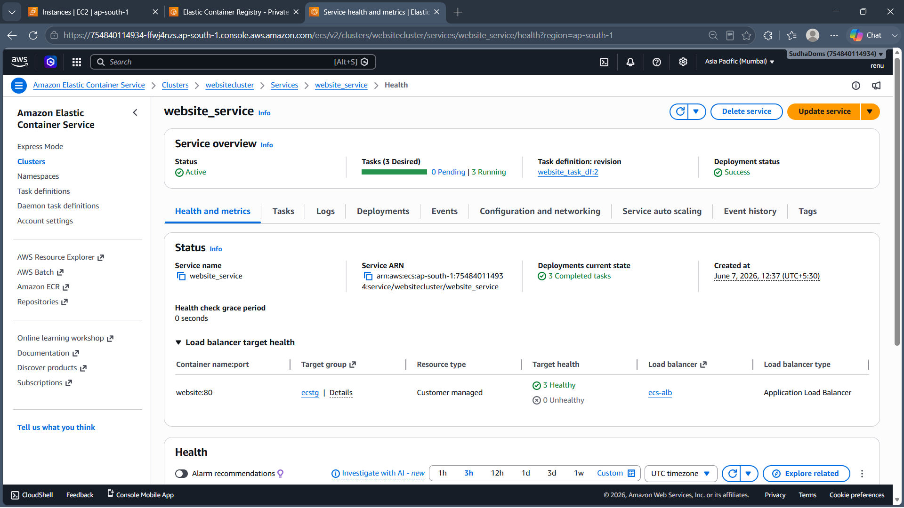

# AWS ECS CI/CD Pipeline
## Project Overview
This project demonstrates both manual deployment and automated CI/CD deployment of a containerized web application on AWS. \
The application is containerized using Docker, stored in Amazon ECR, and deployed to Amazon ECS Fargate. The deployment process is first performed manually to understand the complete workflow and then automated using AWS CodeBuild and AWS CodePipeline integrated with GitHub.

## Architecture
### Deployment Architecture

### CI/CD Architecture

### Manual Deployment Workflow
GitHub Repository → EC2 Instance → Docker Build → Amazon ECR → ECS Cluster → Task Definition → ECS Service → Application Load Balancer → Users
### Automated CI/CD Workflow
GitHub → AWS CodePipeline → AWS CodeBuild → Amazon ECR → Amazon ECS Fargate → Application Load Balancer → Users

## AWS Services Used
•	Amazon EC2 \
•	Amazon ECR (Elastic Container Registry) \
•	Amazon ECS (Elastic Container Service) \
•	AWS Fargate \
•	AWS CodeBuild \
•	AWS CodePipeline \
•	Application Load Balancer (ALB) \
•	Auto Scaling \
•	AWS IAM \
•	Amazon CloudWatch 

## Technologies Used
•	Docker \
•	Git \
•	GitHub \
•	HTML \
•	CSS \
•	JavaScript \
•	AWS CLI \
•	Linux (Amazon Linux 2023)

## Phase 1: Manual Deployment
### Steps Performed
1.	Launched Amazon Linux EC2 instance.
2.	Installed Git and Docker.
3.	Cloned source code from GitHub.
4.	Created Docker image using Dockerfile.
5.	Created Amazon ECR repository.
6.	Tagged and pushed Docker image to ECR.
7.	Created ECS Cluster using AWS Fargate.
8.	Created Task Definition.
9.	Created ECS Service.
10.	Configured Application Load Balancer.
11.	Enabled Auto Scaling.
12.	Successfully deployed and accessed the application.

### Amazon ECR Repository

### Amazon ECS Cluster

### Amazon ECS Service

### Running Application

## Phase 2: Automated CI/CD Pipeline
### CI/CD Workflow
1.	Developer pushes code to GitHub.
2.	AWS CodePipeline detects source code changes.
3.	AWS CodeBuild builds Docker image automatically.
4.	Image is pushed to Amazon ECR.
5.	ECS Service is updated automatically.
6.	New tasks are deployed without manual intervention.

### AWS CodeBuild Success

### AWS CodePipeline Success

### Updated Application After Git Push

## Key Learnings
•	Docker containerization \
•	Container image management using Amazon ECR \
•	ECS Fargate deployment \
•	Task Definitions and Services \
•	Load Balancer configuration \
•	Auto Scaling \
•	CI/CD automation using CodeBuild and CodePipeline \
•	GitHub integration with AWS services \
•	Infrastructure deployment workflow 
